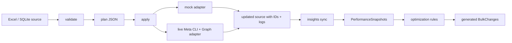

# Architecture

## Modules

- `storage.py`: Reads and writes Excel, SQLite, and CSV-directory sources.
- `validators.py`: Validates required fields, relationships, dates, budgets, statuses, assets, and bulk-edit compatibility.
- `planner.py`: Converts desired source state into ordered create/update/upload/duplicate/delete actions.
- `adapters.py`: Executes actions in mock mode, live Meta CLI mode, or live Graph API mode.
- `executor.py`: Runs actions, resolves dependencies, collects updates, and appends publish logs.
- `insights.py`: Creates mock insight rows or calls live `meta ads insights get`.
- `optimization.py`: Turns insight thresholds into approved bulk changes.
- `cli.py`: Command-line entry point.

## Design Choices

- Stable internal keys are required because Meta IDs do not exist before creation.
- All IDs are written back after publish so future runs are idempotent.
- New objects are planned from blank ID columns; approved bulk edits are planned from unapplied `BulkChanges` rows.
- CLI-supported actions stay CLI-first; audiences, uploads, advanced targeting, Advantage+ toggles, duplicates, JSON patches, and deletes use Graph API action metadata.
- The planner emits a JSON plan before apply so the team can review exactly what will change.
- Mock mode uses deterministic IDs so demos are repeatable.
